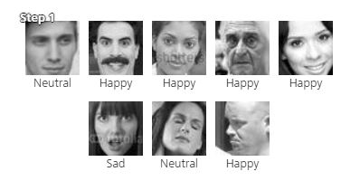
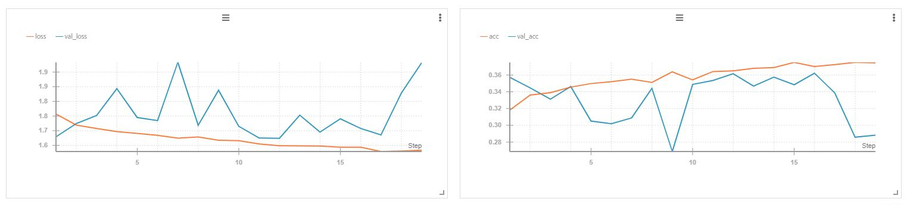
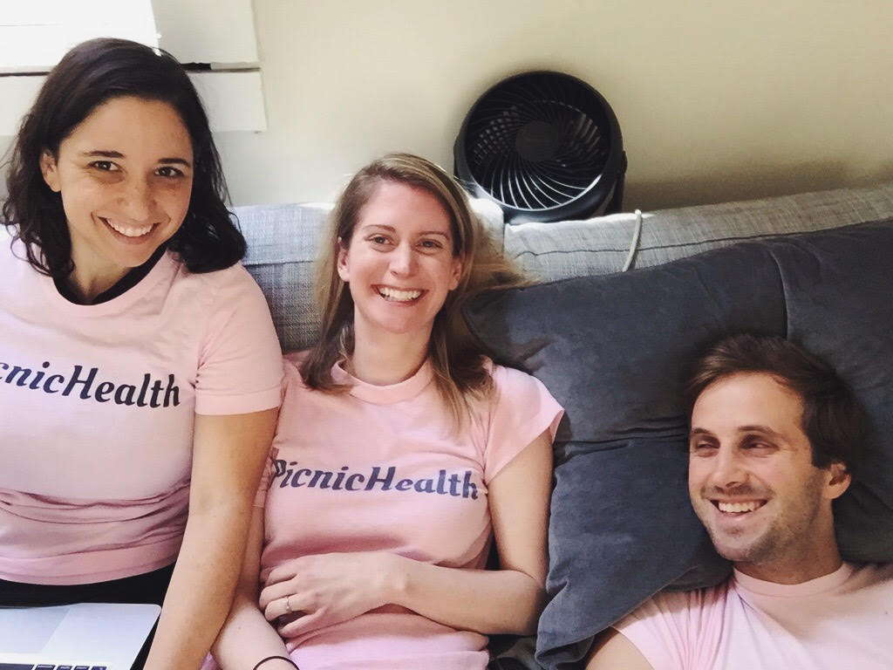
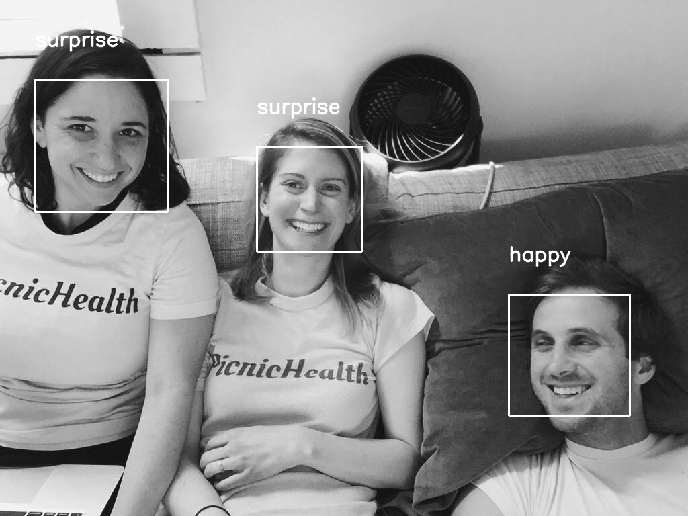
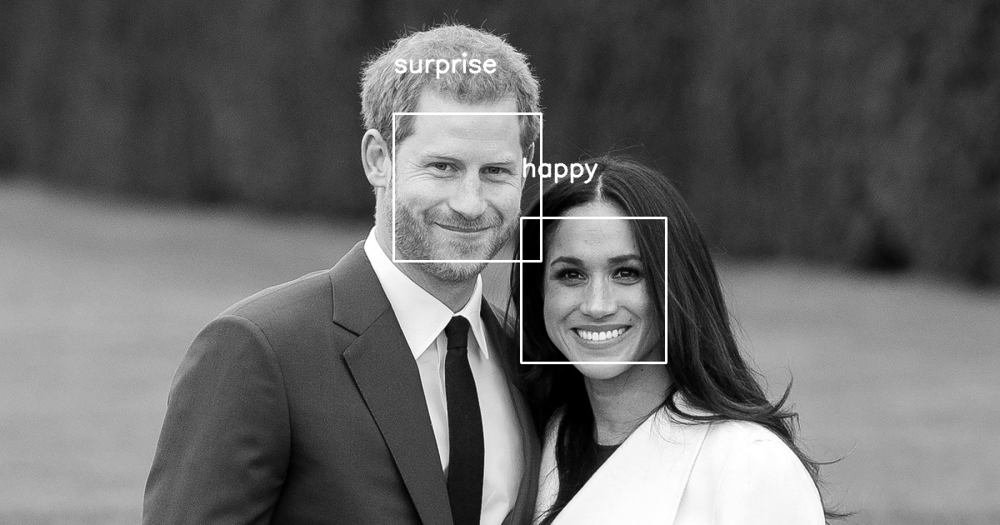

# Emotion Classifier

### Dataset fer2013

The data consists of 48x48 pixel grayscale images of faces. The faces have been automatically registered so that the face is more or less centered and occupies about the same amount of space in each image. The task is to categorize each face based on the emotion shown in the facial expression in to one of seven categories (0=Angry, 1=Disgust, 2=Fear, 3=Happy, 4=Sad, 5=Surprise, 6=Neutral).

Below can be seen an subset of the images collected and processed for the dataset in use.

<figure>
  
</figure>
Fig 1. Sample of pictures extracted from the dataset fer2013

### Analysis and Model

WANDB: The W&B client is an open source library and CLI (wandb) for organizing and analyzing your machine learning experiments. Think of it as a framework-agnostic lightweight TensorBoard that persists additional information such as the state of your code, system metrics, and configuration parameters.

<figure>
  
</figure>
Fig 2. Model Loss and Accuracy

### Results

  

    
  

  

    
  

  

Fig 3. Validation Test with 3 faces (color picture Original, grayscale picture Processed)

  

    
  

  

    
  

  

Fig 4. Validation Test with 2 faces (color picture Original, grayscale picture Processed)

### Refeences and Acknowledgement

"Challenges in Representation Learning: A report on three machine learning contests." I Goodfellow, D Erhan, PL Carrier, A Courville, M Mirza, B Hamner, W Cukierski, Y Tang, DH Lee, Y Zhou, C Ramaiah, F Feng, R Li, X Wang, D Athanasakis, J Shawe-Taylor, M Milakov, J Park, R Ionescu, M Popescu, C Grozea, J Bergstra, J Xie, L Romaszko, B Xu, Z Chuang, and
Y. Bengio. arXiv 2013.

